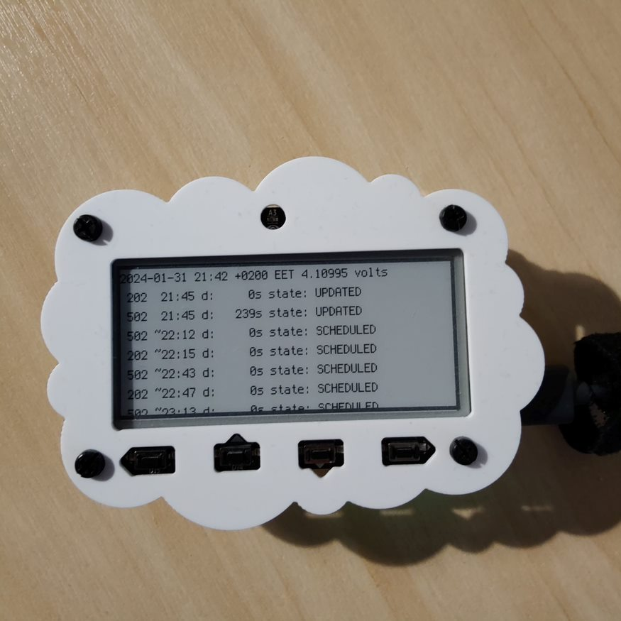

# magtag-digitransit

## Hardware

[Adafruit](https://www.adafruit.com/product/4800) Magtag with [CircuitPython](https://circuitpython.org/board/adafruit_magtag_2.9_grayscale/)

Out of stock on January 2023

[Main documentation](https://learn.adafruit.com/adafruit-magtag) on Adafruit web page.

## Requirements

* [Install UF2 Bootloader](https://learn.adafruit.com/adafruit-magtag/install-uf2-bootloader)
* [Install CircuitPython](https://learn.adafruit.com/adafruit-magtag/circuitpython)
* [Install CircuitPython libraries](https://learn.adafruit.com/adafruit-magtag/circuitpython-libraries-2)
  * TBD
* Copy code into device USB device

## Tested versions

* TinyUF2 Bootloader 0.18.1 (Nov 14 2023)
* TAdafruit CircuitPython 8.2.9 on 2023-12-06
* CircuitPython libraries version relases Feb 24, 2022 -ish: <https://github.com/adafruit/CircuitPython_Community_Bundle/releases/tag/20220217>
  * Required modules
    * adafruit_datetime.mpy
    * adafruit_magtag/
      * via code.py
      * Dependency will be removed soon
    * adafruit_bitmap_font
      * via adafruit_portalbase/__init__.py
    * adafruit_io
      * via adafruit_magtag -> adafruit_magtag/network -> adafruit_portalbase/network
      * Will be removed?
    * adafruit_minimqtt
      * via adafruit_magtag -> adafruit_magtag/network -> adafruit_portalbase/network -> adafruit_io
      * Will be removed?

## Future changes

* v7.2.0 CircuitPython added frozen modules for Magtag => No need to copy them into device: adafruit_display_text, adafruit_fakerequests, adafruit_lis3dh, adafruit_portalbase, adafruit_requests, neopixel
  * Magtag documentation have not been updated for this

